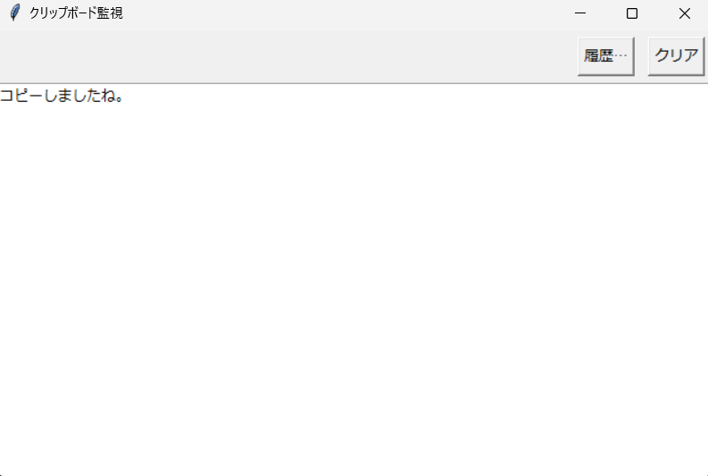

# クリップボード監視ツール

Python 3.10 + tkinterだけで動く、Windows向けのテキスト専用クリップボード監視ツールです。起動すると自動でクリップボードを監視し、コピーされたテキストを表示します。ウィンドウのリサイズに応じてフォントサイズも自動調整します。

## 主な機能
- 自動監視（起動時に開始、既定500msポーリング）
- テキスト専用（プレーンテキストのみを対象）
- ウィンドウのリサイズに連動してフォントサイズを自動調整
- 履歴の保持（最新が先頭、最大100件）
- 履歴からの再コピー（ダブルクリック/Enter/「コピーして閉じる」ボタン）
- クリアボタンでクリップボードを空文字に設定

## 前提条件
- OS: Windows 10/11（クリップボード監視は Windows 前提）
- Python: 3.10以上（3.10 で動作確認）
- 追加インストール: 不要（標準ライブラリのみ使用）

## スクリーンショット

- メイン画面


- 履歴ウィンドウ
  


## クイックスタート
```bash
python main.py
```

## 使い方
- 監視: 起動直後からテキストのクリップボードを自動検知して表示します。
- 履歴: 「履歴…」ボタンで履歴ウィンドウを開きます。
  - リストから項目を選び、ダブルクリックまたは Enter で再コピー（または「コピーして閉じる」ボタン）。
- クリア: 「クリア」ボタンでクリップボードを空文字にし、表示も空にします。
- リサイズ: ウィンドウの大きさに合わせてフォントが自動で拡大・縮小されます。

## 設定（コード内定数）
- ポーリング間隔: `POLL_INTERVAL_MS`（ミリ秒）
- 履歴最大件数: `HISTORY_MAX_ITEMS`
- 基準サイズ/フォント: `base_width`, `base_height`, `base_font_size`
- フォント上下限: `_on_configure` 内の最小・最大サイズ

## 実装ファイル
- アプリ本体: `main.py`
  - エントリポイント: `main()`
  - 主要クラス: `ClipboardMonitorApp`
    - 監視: `_poll_clipboard`
    - 表示更新: `_update_textbox`
    - 履歴: `_push_history`, `_open_history_window`, `_on_history_copy`
    - クリア: `_on_clear`

## EXE化（配布用ビルド: PyInstaller）
Windows向け単一の実行ファイルを作る例です。初回のみPyInstallerをインストールします。

1) 仮想環境（任意ですが推奨）
```powershell
python -m venv .venv
.\.venv\Scripts\Activate.ps1
```

2) PyInstallerのインストール
```powershell
python -m pip install --upgrade pip
python -m pip install pyinstaller
```

3) ビルド（コンソール非表示・単一ファイル）
```powershell
pyinstaller --onefile --noconsole --name ClipMonitor main.py
```

- 生成物は `dist/ClipMonitor.exe` に出力されます。
- アイコンを付けたい場合は `.ico` を用意して次のようにします。
```powershell
pyinstaller --onefile --noconsole --name ClipMonitor --icon assets/app.ico main.py
```

4) 配布
- `dist/ClipMonitor.exe` を配布してください。初回起動時にSmartScreenが表示されることがあります。

トラブルシュート
- 文字化けやフォントに関する問題がある場合は、Windows側の日本語フォント設定をご確認ください。
- 実行時にDLLが見つからない等のエラーが出る場合は、再ビルド前に `pyinstaller --clean ...` を付与してください。

## 注意・制限
- テキスト以外がクリップボードにある場合や他アプリがロック中の場合は取得をスキップし、次回ポーリングで再試行します。
- 本ツールはWindowsのクリップボードを前提としています。
- 履歴はメモリ保持のみ（アプリ終了で消去）。永続化が必要な場合はご相談ください。
